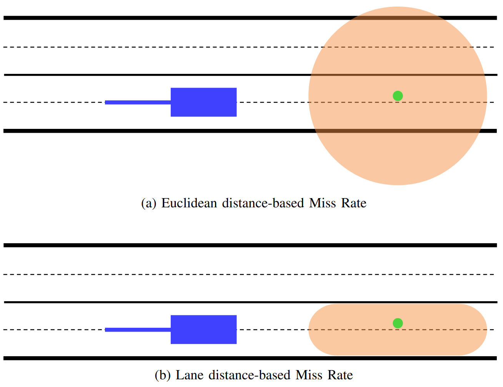

# LMR: Lane Distance-Based Metric for Trajectory Prediction

Official repository of the paper:\
**[LMR: Lane Distance-Based Metric for Trajectory Prediction](https://arxiv.org/abs/2304.05869)**\
Julian Schmidt, Thomas Monninger, Julian Jordan and Klaus Dietmayer\
Accepted at 2023 IEEE Intelligent Vehicles Symposium (IV)



## Citation
If you use our source code, please cite:
```bibtex
@InProceedings{schmidt2023lmr,
  author={Julian Schmidt and Thomas Monninger and Julian Jordan and Klaus Dietmayer},
  booktitle={2023 IEEE Intelligent Vehicles Symposium (IV)}, 
  title={LMR: Lane Distance-Based Metric for Trajectory Prediction}, 
  year={2023},}
```

## License
<a rel="license" href="http://creativecommons.org/licenses/by-nc/4.0/">
</a><br />Lane Miss Rate is licensed under <a rel="license" href="http://creativecommons.org/licenses/by-nc/4.0/"
 >Creative Commons Attribution-NonCommercial 4.0 International License</a>.
 
Check [LICENSE](LICENSE) for more information.

## Installation
### Installation of the Official Argoverse 2 Api
The [official Argoverse 2 api](https://github.com/argoverse/av2-api) is required to calculate the metric.
If you already have a `conda` environment with the api set up, you can skip this step.
Otherwise, please follow the [instructions](https://argoverse.github.io/user-guide/getting_started.html#setup) given in the official repository.

### Installation of Additional Packages
In your `conda` environment, please install these two additional packages.
```sh
pip install rtree
conda install shapely
```

## Basic Usage
### Initialize Metrics
In addition to the Lane Miss Rate (LMR), Euclidean metrics are also implemented.
```python
from metric.euclidean_metrics import EuclideanMetrics
from metric.lane_miss_rate import LaneMissRate

euclidean_metrics = EuclideanMetrics()
lane_miss_rate = LaneMissRate(dataset_root=PATH_TO_DATASET_ROOT, plot_dir=None)
```

### Usage
```python
euclidean_results = euclidean_metrics.compute_euclidean_metrics(forecasted_trajectories, gt_trajectories)
lmr_results = lane_miss_rate.compute_lane_miss_rate(forecasted_trajectories, gt_trajectories)
```

## Full Example
Check out [test.py](test.py) for a complete example on how to calculate LMR and Euclidean metrics using the code provided in this repository.
Make sure to adjust the `argparse` parameters to your needs.